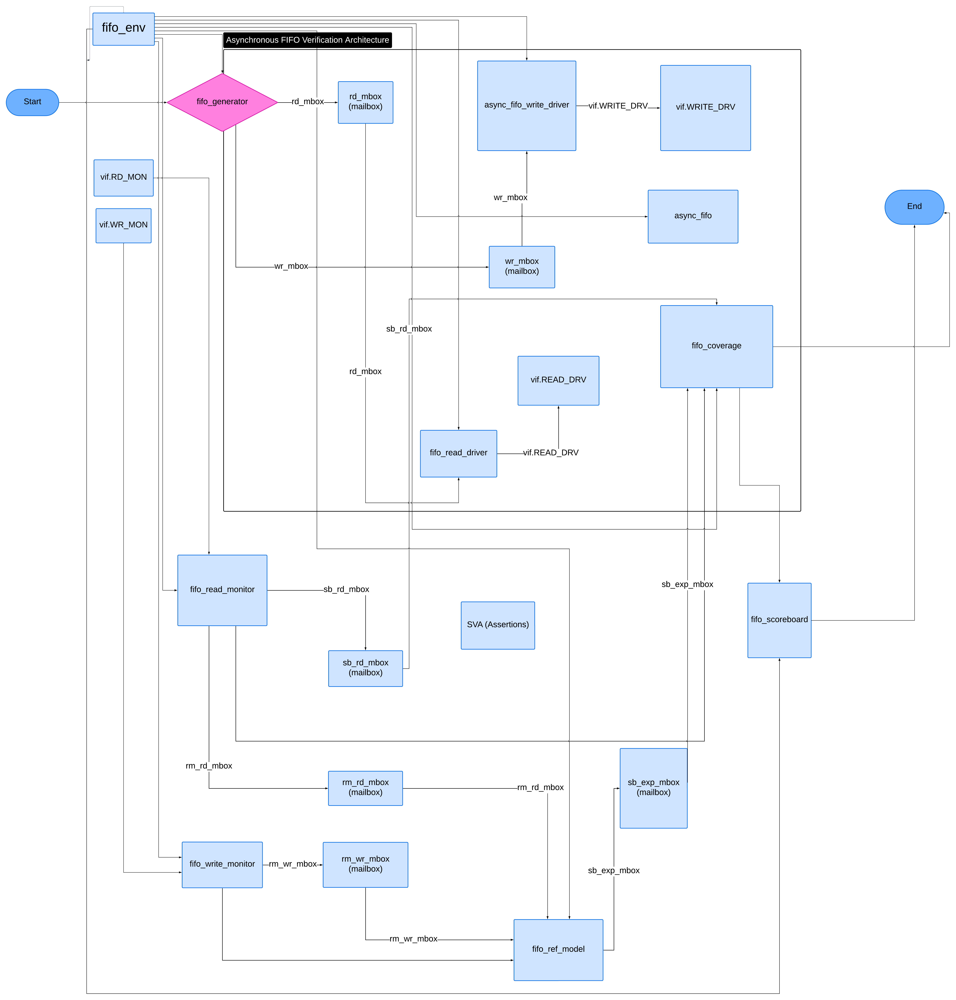
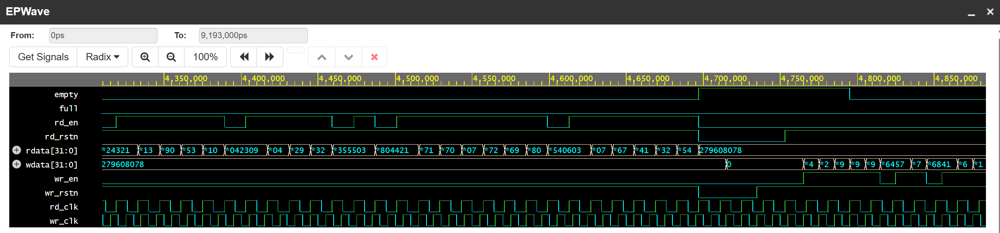
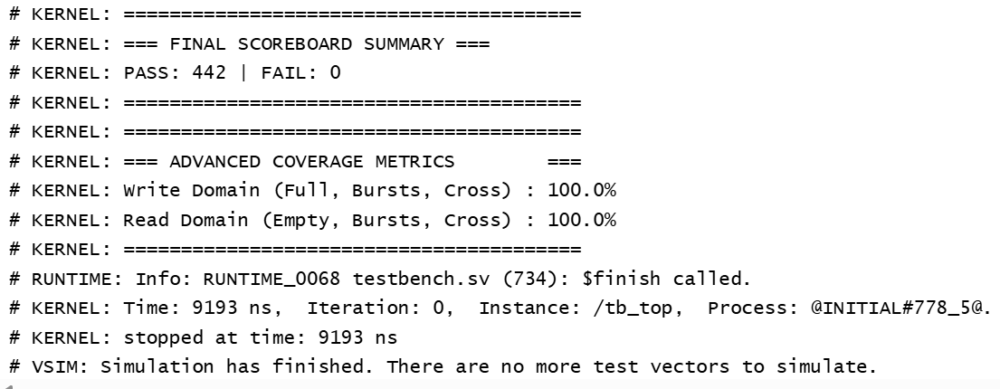

# Asynchronous FIFO with SystemVerilog Verification Environment

This repository contains the RTL design of an Asynchronous FIFO written in Verilog, along with a complete class-based SystemVerilog verification environment.

The project handles safe data transfer across two independent clock domains (read and write) and verifies the design against various stress and corner-case scenarios.

---

## Design Overview

The core design is a parameterized Asynchronous FIFO.

### Default Configuration

* **FIFO Depth:** 64
* **Data Width:** 32 bits

### Key Design Techniques

To safely manage data crossing between independent clock domains, the design uses:

* **Gray Code Pointers**

  * Binary read and write pointers are converted to Gray code before crossing clock domains.
  * Since only one bit changes at a time, Gray code prevents intermediate invalid states during synchronization.

* **2-Stage Synchronizers**

  * Gray-coded pointers are passed through double flip-flop synchronizers in the destination clock domain.
  * This mitigates metastability during clock-domain crossing (CDC).

* **Flag Logic**

  * The `empty` flag is evaluated in the read domain by comparing:

    * local read pointer
    * synchronized write pointer

  * The `full` flag is evaluated in the write domain by comparing:

    * local write pointer
    * synchronized read pointer

  * Full detection includes wrap-around condition checking.

---

## Architecture & Verification Environment



*Figure 1: Block diagram of the SystemVerilog verification environment showing the independent read/write domains, SVA checks, and transaction flow.*

## Verification Environment

The testbench is built completely from scratch using a custom class-based SystemVerilog verification environment to rigorously verify the FIFO.

### Verification Architecture

#### Transactions

Defines randomized:

* Read operations
* Write operations
* Burst lengths
* Data payloads

#### Drivers & Monitors

Independent components exist for both clock domains.

* **Drivers**

  * Generate pin-level activity
  * Drive DUT interface signals

* **Monitors**

  * Passively observe DUT behavior
  * Capture bus activity
  * Forward transactions to:

    * Reference model
    * Scoreboard

#### Reference Model

A shadow FIFO implemented using a SystemVerilog queue predicts expected DUT behavior.

* Pushes incoming write data
* Pops expected read data
* Serves as the golden reference model

#### Scoreboard

Compares:

* Expected data from the reference model
* Actual DUT output data

Any mismatch is immediately flagged.

#### Assertions (SVA)

Protocol-level checks are embedded directly inside the interface using concurrent assertions.

The assertions continuously monitor the DUT and immediately flag illegal conditions, including:

* Write attempts immediately after the FIFO flags `full`
* Read attempts immediately after the FIFO flags `empty`

This provides cycle-accurate protocol checking alongside functional verification.

#### Functional Coverage

Covergroups track:

* `full` flag behavior
* `empty` flag behavior
* Read/write enable toggles
* Burst activity
* Cross-coverage between flags and traffic conditions

Coverage ensures:

* Back-to-back bursts are exercised
* Boundary conditions are verified
* Concurrent traffic scenarios are hit naturally

---

## Test Scenarios

The generator runs several directed-random test sequences to stress the FIFO.

### Sanity Test

Basic write and read operations to verify:

* FIFO functionality
* Data integrity
* Correct ordering

### Stress Test

* Completely fills the FIFO
* Completely drains the FIFO
* Verifies correct full/empty transitions

### Concurrent Traffic Test

Simultaneous randomized:

* Read bursts
* Write bursts

Used to validate CDC robustness under heavy activity.

### Starvation / Slow Write Test

* Delayed writes with continuous reads
* Verifies:

  * Empty flag stability
  * Underflow handling behavior

### Burst into Full Wall Test

Forces exact multi-beat bursts into the FIFO boundary to:

* Intentionally hit the 64-depth wall
* Verify:

  * Proper `full` assertion
  * No dropped data
  * No corruption
  * Assertion correctness under saturation

---

## Simulation and Results

The design was simulated using:

* EDA Playground

The verification suite successfully passed all tests with:

* Zero mismatches
* Zero assertion violations

### Final Results

| Metric                | Result                |
| --------------------- | --------------------- |
| Transactions Checked  | **820 PASS / 0 FAIL** |
| Write Domain Coverage | **100.0%**            |
| Read Domain Coverage  | **100.0%**            |

---

## Waveforms and Logs



*Figure 2: EPWave waveform showing independent read and write clocks, data bus transitions, and the behavior of the full and empty flags during concurrent traffic.*



*Figure 3: Console output summarizing the clean scoreboard pass and 100% functional coverage metrics across both clock domains.*

---

## How to Run

### 1. Clone the Repository

```bash
git clone https://github.com/RoshXplore/Design-of-Async-FIFO-with-UVM-Style-Verification
cd Design-of-Async-FIFO-with-UVM-Style-Verification
```

### 2. Compile the Design

Load the following files into your simulator:

```text
async_fifo.sv
tb_top.sv
```

Supported simulators:

* QuestaSim
* ModelSim
* EDA Playground
* Riviera-PRO

### 3. Enable SystemVerilog + SVA Support

Ensure your simulator is configured with:

* SystemVerilog enabled
* SVA (SystemVerilog Assertions) enabled

Example:

```bash
vlog -sv async_fifo.sv tb_top.sv
```

### 4. Run the Simulation

```bash
vsim tb_top
run -all
```

The environment is fully self-checking and automatically prints:

* Pass/fail summary
* Assertion status
* Coverage report
* Final scoreboard statistics

at the end of simulation.

---

## Features Summary

* Parameterized asynchronous FIFO
* Independent read/write clock domains
* Gray-code CDC synchronization
* 2-stage pointer synchronizers
* Custom class-based SV verification environment
* Concurrent SVA protocol checking
* Reference model + scoreboard architecture
* Functional coverage-driven verification
* Directed-random stress testing
* Concurrent burst traffic verification
* 100% functional coverage achieved

---

## Future Improvements

Potential future extensions include:

* Formal verification
* UVM migration
* Configurable almost-full / almost-empty flags
* AXI-Stream interface wrapper
* Randomized clock ratio testing
* Error injection testing
* CDC static analysis integration
